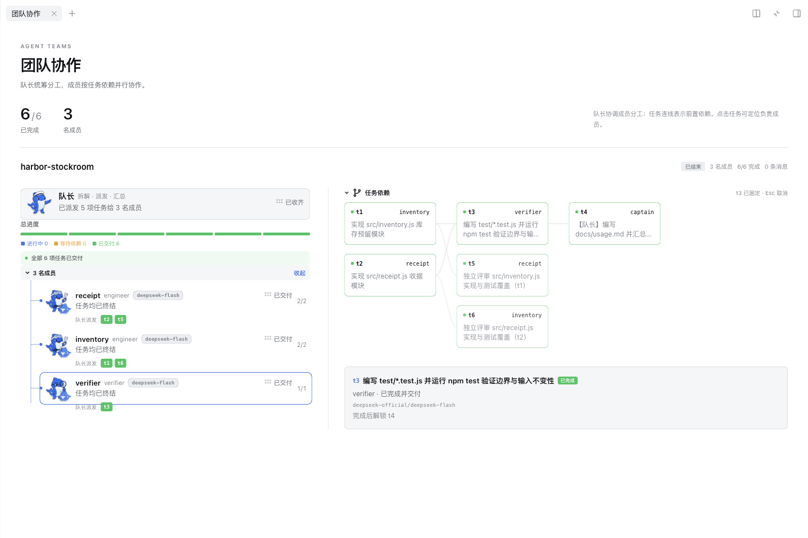
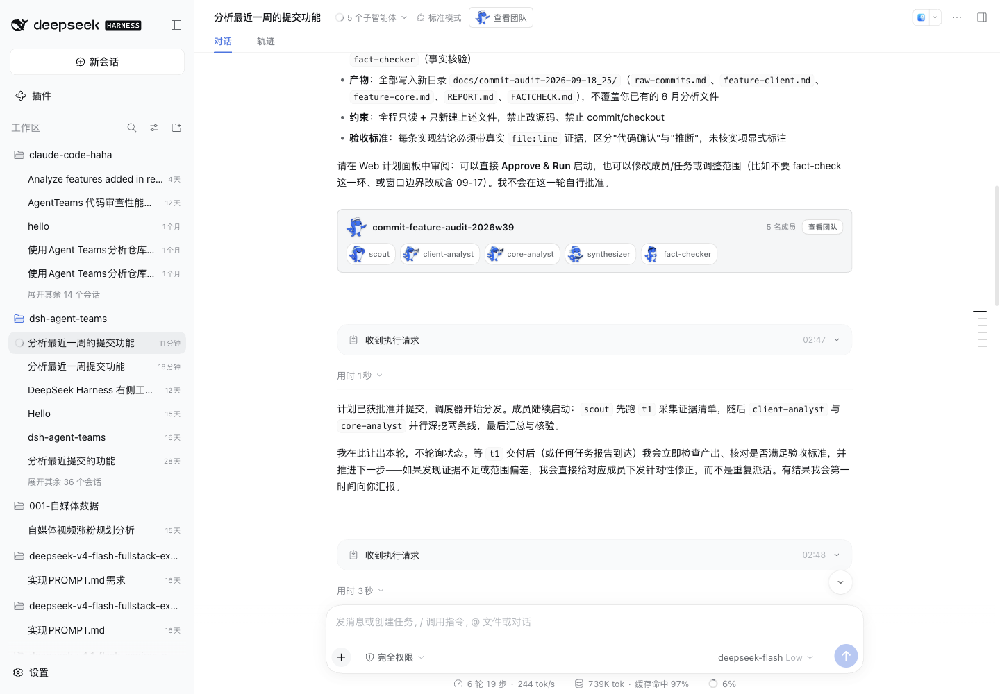

# Issue #181：原生工作区与真实模型验证

验证日期：2026-09-25。实现使用官方 `sidebarRightTabs` 与 `sidebar.right.pane.tab` 扩展接口；未修改 Harness 源码、未拼接宿主 DOM。旧宿主没有这些服务时继续使用原活动面板。

## 展现与交互

- 普通右栏与全屏共用“团队协作”标签。宽度足够时左侧呈现队长、成员、负责的任务，右侧呈现任务依赖和详情；窄栏自动纵向排列。
- 人员树表达队长派工关系；任务图表达前置依赖，不虚构成员之间的社交或汇报连线。节点显示任务名称和负责人，点击节点固定详情并高亮对应成员，Esc 取消。
- 执行前可审查成员/模型、修改任务、确认启动或放弃。计划编辑与执行监控复用既有业务操作。
- 关闭标签仅关闭视图，任务继续运行；重新打开后读取现状。恢复已有团队不会自动弹窗，新团队自动展开也不会覆盖已打开的文件或终端。
- 数据订阅独立于标签正文；分栏的两个团队视图共享轮询。历史、当前团队与选择均按队长会话隔离。

## 实测环境与证据

主要环境为 macOS + Ego Lite 浏览器 + npm Harness **0.1.7-rc.2**。核对 273 个 DSH 依赖包，磁盘版本均为该版本。源码参考 `/Users/nanmi/workspace/github/deepseek-harness`，HEAD `477b4f4205`。

项目和隔离配置位于 `/tmp/agent-teams-workspace-181`；模型为 **deepseek-official / deepseek-flash / max**。使用现有凭据引用，未复制凭据。工具调用、团队文件、源码、测试与模型会话是真实产生的，没有通过伪造接口响应或手改团队状态制造场景。

正常项目 `workspace` 实现库存预留和收据计算。3 名成员完成 6 项任务，覆盖并行开发 → 依赖解锁 → 测试 → 队长文档以及交叉评审。成员会话中实际存在 write/edit/bash 调用。由本次验证者独立复跑 `npm test`，**52/52 通过**；额外内联断言验证库存扣减、超卖拒绝、输入不变性与收据金额。

[结构化证据](evidence.json) 包含实际会话 ID、任务依赖/终态、写入调用数、源码哈希、模型日志哈希和最终 npm 包 SHA-256。完整原始日志保留于上述 `/tmp` 目录，未将大量模型日志或授权 URL 加入仓库。

## 验证矩阵

| 场景 | 结果 |
| --- | --- |
| 无团队时手动打开、返回对话 | 空状态正确，返回关闭本标签 |
| 真实模型制定计划、用户确认 | 新团队打开原生标签；确认后创建真实成员并运行 |
| 编辑计划中的任务名称后保存 | 保存成功，持久化标题正确；修复长表单确认栏遮挡保存按钮的问题 |
| 并行任务、等待依赖、解锁、交叉评审 | 真实 6 项任务完成，关系与负责人正确 |
| 运行时关闭、等待、刷新、手动重开 | 工作继续，关闭后没有自动抢回视图，重开恢复进度 |
| 打开成员会话、返回队长、切换其他团队 | 导航正确，无父团队串入其他会话 |
| 同一团队分栏显示 | 两个正文显示一致，网络轮询约每秒一次，未翻倍 |
| 归档并切换会话后恢复 | 原团队 6/6 完成可查看，点击 t3 高亮 verifier |
| 真实团队运行后停止；先取消确认，再确认停止 | halted=true，两项任务 cancelled；没有恢复执行 |
| 刻意执行 `node -e 'process.exit(7)'` | 真实成员记录 exitCode=7、failed；不重试；UI 明确失败和等待显式重试 |
| 浏览器断网与恢复 | 保留最后快照，显示错误与重试入口，网络恢复后错误消失 |
| 全屏、普通右栏、约 415px 窄栏、385px 小屏 | 布局响应正确，无页面横向溢出；浅色/深色均人工查看截图 |
| 最终 npm 包安装后冷启动 | 归档、停止和失败状态恢复；包内 client.js 与最终构建一致 |
| Harness 0.1.2-rc.1 | 同版本客户端代码正常回退原面板；真实模型 high 创建 staged 计划；关闭/刷新/重开/确认放弃成功，成员未创建 |

## 检查与范围

`pnpm build`、`node scripts/verify.mjs`、`pnpm verify:harness-contract` 均通过；最终补跑的客户端迁移与工作区专项测试共 9/9 通过，`git diff --check` 通过。专项测试覆盖发现/重开策略、会话隔离、断网与坏响应恢复、销毁后的迟到响应以及放大节点后的依赖线端点。

验证过程中修复了容器查询跨 CSS Module 不生效、节点位置和宽度不一致、表单保存被遮挡，以及取消/失败状态仍显示可以开工的文案。最终包为 `final-artifact/nanmicoder-dsh-agent-teams-0.1.21-rc.1.tgz`；此前实时运行阶段使用构建后的客户端更新，最后再以完整打包产物冷启动复核。旧版验证为隔离提取产物加载最终客户端代码。

本轮覆盖上述 Web 场景；未声称穷尽所有情况。Windows/Electron 独立浮窗、多设备同步、更多模型供应商没有实测。没有改后端调度协议、没有发布 npm 或提交 PR。

## 真人验收后的断点修复

用户发现中间宽度下标题和成员区错占两列，任务图区掉到下一行。此前抽样未覆盖到该缺陷，原验证矩阵不能视为所有中间宽度均正确。

根因是 `.team` 本身也是查询容器：父网格按外层工作区判断断点，子元素按扣除内边距后的 `.team` 判断，同一条媒体规则在父子之间不同步。原生视图移除这层嵌套查询容器，使布局统一查询工作区；同时两列起点从 720px 提高到 1000px，避免中等宽度挤压成员信息。旧活动面板保留自己的查询容器。

在用户实际 `127.0.0.1:3080` 页面使用真实五成员执行团队和四成员待确认计划复核，每种状态测试 360、415、719、720、760、791、792、999、1000、1001、1039、1072、1440 共 13 档宽度。26 次布局检查全部通过：标题在内容上方；两列时对应区域顶部对齐；单列时依次排列；页面无横向溢出。DAG 自身允许横向滚动。测量数据见 `breakpoint-running.json`、`breakpoint-staged.json`。760px 修复前实际复现错位，修复后截图检查为完整纵向布局。

该 CSS 修复已同步到本地 main 并重新构建，浏览器刷新后读取到新样式，无需停止正在执行的团队。本次断点修复后未重打前文 npm 包，前文包哈希仍对应初版验证产物。

## 聊天入口恢复

用户指出团队应该关联聊天，工作区“开始”页不应出现全局团队按钮。移除 `sidebarRightTabs` 的 guide 条目；保留工作区正文作为打开目标。新增当前会话标题旁的带队长图标“查看团队”按钮，仅有该会话的团队/归档记录时显示。

原工具调用卡片被新版 Harness 的 whole-turn process disclosure 折叠。通过官方 `conversation.chat.turnTail` 将已结束创建轮次的同一卡片呈现在回答尾部，恢复队长/成员头像与查看按钮；原过程位置在该轮关闭后不再重复显示。成员图标仍可进入对应成员会话。原始工具记录未改写，多团队按创建轮次筛选，旧宿主保留原节点渲染。

本机 Web 实测：五成员真实团队的历史创建回答显示 1 张卡片与 6 张图像（队长+5成员）；卡片打开正确队长会话的原生正文；关闭后标题入口可重开；四成员待确认计划卡片打开自己的计划；普通 Hello 会话不显示团队入口；点击 scout 图标进入成员会话，父团队入口不会串入；刷新后卡片与标题入口恢复；“开始”页仅保留文件/终端入口。未代替用户启动或停止任务。

## 顶部信息精简

删除原生团队正文中重复的品牌标题、介绍段落与大号人数/完成统计。直接从团队名称、既有统计与操作开始；空状态继续提供创建引导。关系说明保留在队长与依赖图附近。相同本机右栏宽度 1027.5px 下，成员区距正文顶部由 297.8px 缩短至 68px，节省约 230px。补查 415/760/1001/1440px，标题均位于成员前、页面无横向溢出。本地 main 已同步并完成构建。

## Stable release candidate 0.1.21

The final client fixes passed local typecheck, build and the full `pnpm verify` gate. A packed 0.1.21 artifact passed all eight runtime scenarios (plus cold recovery) on the exact 273-package Harness 0.1.7-rc.2 cohort. This runtime probe uses a deterministic model fixture; the real-model project runs are recorded above.

An isolated Web profile loaded the packed artifact and reopened the real Harbor project's archive from its chat header. Checked compact content, 760/1440-pixel layouts, closing and reopening the tab. The README screenshot comes from this isolated project, not the user's daily conversation. Final publication uses GitHub Actions' separately packed and fully verified artifact.
